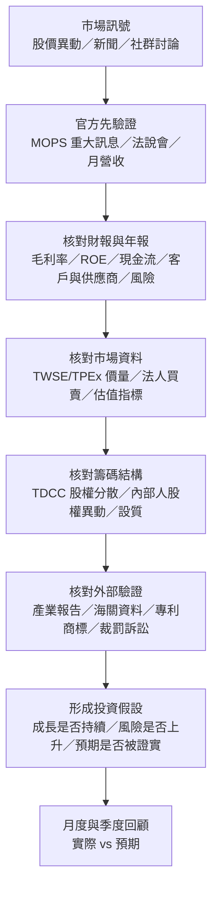

# 台股個股研究可參考網站與資料來源分析報告

## Executive Summary

要評估一檔台股公司「未來發展是否可信」與「過去表現是否符合預期」，最穩健的做法不是先看看盤 App，而是先建立一個**官方優先、逐層交叉驗證**的資料架構。第一層應以由 entity["organization","臺灣證券交易所","Taiwan Stock Exchange"] 維運的 url公開資訊觀測站 MOPShttps://mops.twse.com.tw/mops/web/index 為核心，因為它直接承接上市、上櫃、興櫃與公開發行公司的財務、營運、治理與重大訊息揭露；第二層再接上 urlTWSE 官網https://www.twse.com.tw/、urlTWSE 基本市況報導 MIShttps://mis.twse.com.tw/、由 entity["organization","證券櫃檯買賣中心","Taipei Exchange"] 提供的 urlTPEx 官網https://www.tpex.org.tw/ 與 urlTPEx 市場訊息中心https://info.tpex.org.tw/，取得價格、成交量、三大法人與官方衍生估值指標；第三層再用由 entity["organization","臺灣集中保管結算所","Taiwan Depository & Clearing Corporation"] 提供的 urlTDCC 集保戶股權分散表https://www.tdcc.com.tw/portal/zh/smWeb/qryStock、由 entity["organization","金融監督管理委員會證券期貨局","Taiwan Securities and Futures Bureau"] 維運的 url證期局裁罰案件https://www.sfb.gov.tw/ch/home.jsp?id=102&parentpath=0%2C2 與 url證券暨期貨法令判解查詢系統https://www.selaw.com.tw/，把籌碼、治理與法遵風險補齊。citeturn6view0turn35search12turn9view1turn36view1turn16search2turn26search0

若你的目的是**驗證公司有沒有「照它自己說的方向在走」**，最有用的組合通常是：MOPS 的月營收、季報與重大訊息；公司官網 IR 專區的法說會投影片與影音；年報中對市場、客戶、供應、競爭與風險的敘述；再加上海關進出口、產業價值鏈、專利/商標與裁罰/訴訟紀錄，去檢查敘事是否真的被外部資料支持。換句話說，**先看公司怎麼說、再看它怎麼做、最後看外部世界是否證實它真的做到了**。citeturn31search0turn31search1turn31search3turn18search4turn18search3turn15search0turn15search1turn15search6

像 urlYahoo奇摩股市https://tw.stock.yahoo.com/、urlGoodinfo! 台灣股市資訊網https://goodinfo.tw/tw/index.asp、urlCMoney 股市https://www.cmoney.tw/finance/、url財報狗https://statementdog.com/、urlMoneyDJ 台股https://www.moneydj.com/Z/ZA/ZAA/ZAA.djhtm、url鉅亨網台股https://www.cnyes.com/twstock、urlInvesting.comhttps://www.investing.com/ 這些網站很適合做**快速總覽、圖表整理、選股與新聞監測**，但它們多屬二級整理平台；若數字與官方不一致，應以 MOPS、交易所、櫃買中心、集保與主管機關為準。若你有程式化需求、量化研究或跨資料庫串接需求，才會進一步考慮 urlTEJ APIhttps://api.tej.com.tw/、urlXQ 全球贏家https://www.xq.com.tw/ 或 urlBloomberg Terminalturn23search4 等專業工具。citeturn22search0turn21search2turn22search15turn33search0turn19search7turn20search3turn20search5turn21search1turn21search0turn23search4

## 資料來源分層與評估方法

本文建議把台股個股研究資料分成四層。**第一層是法定原始揭露**，如 MOPS、交易所/櫃買中心、集保、主管機關與法院；**第二層是公司第一手補充資訊**，如公司 IR 專區、法說會投影片、永續報告與股東會資料；**第三層是二級整理平台與媒體**，如 Yahoo、Goodinfo、CMoney、MoneyDJ、鉅亨網、經濟日報、中央社；**第四層是社群討論與市場情緒**，如股市論壇與社群貼文。研究流程應由上往下，不應由下往上。citeturn6view0turn35search12turn9view1turn36view1turn16search2turn15search6turn22search1turn34search0turn34search4

本文表格中的「可信度評分」為**本文自行評分**，不是官方評鑑。評分依據是五件事：是否為原始揭露、是否受法規拘束、可否追溯到原始公告、更新是否規律、以及資料是否容易下載或機器處理。簡化來看，MOPS、TWSE、TPEx、TDCC、證期局、法院、智慧局屬於最高一層；公司 IR 雖然也是第一手，但若與 MOPS 時點不同，應以 MOPS 為準；新聞媒體與二級平台重在效率與可讀性；社群則重在發現議題，不重在定案。citeturn6view0turn31search1turn35search12turn9view1turn36view1turn16search2turn15search6

若你要回答「公司過去表現是否符合預期」，建議用三組基準來比對。第一組是**管理層自己的說法**，包括年報、法說會與重大訊息中的營運展望、資本支出、產品組合、訂單能見度與風險揭露；第二組是**實際揭露的月/季/年數字**，例如營收、毛利率、營業利益率、EPS、現金流與負債結構；第三組是**外部驗證訊號**，例如海關進出口、產業報告、主要技術/專利布局、董監與內部人股權變動、法人買賣、裁罰與訴訟。這三組若一致，投資假設的可信度才高。citeturn31search3turn6view0turn13search0turn18search3turn18search1turn15search0turn16search4turn7view4

## 官方與原始資料來源

### 公司揭露與財報核心來源

公司官網的 IR 專區是第二重要的第一手來源。它的優點在於**資訊整理比 MOPS 更友善**，常把財報、年報、法說會簡報、影音、股東會資料、公司治理與 ESG 文件集中在同一頁；但它通常是公司自行整理與呈現，正式揭露時點仍以 MOPS 與法定申報系統為準。從實際公司頁面可以看到，像 url東科集團投資人專區https://www.eastech.com/zh-hant/investor-relations 會提供年報、永續報告並明示重大訊息由 MOPS 公告；url儒鴻投資人關係https://www.eclat.com.tw/zh-tw/investors/ 則直接整理季度財務報告、法說會投影片與影音。法規面上，年報電子檔必須在股東會前申報至主管機關指定資訊申報網站，且年報內容本身要求具有時效性、不得虛偽或隱匿。citeturn25search5turn17search12turn31search0turn31search1

MOPS 是台股個股研究的核心網站。它揭露上市、上櫃、興櫃與公開發行公司的公開資訊，並可查詢財務狀況、營運概況與公司治理。官方教學頁面明確指出，在 MOPS 可以查到營收資料、財務報告、股利分配、即時重大訊息、歷史重大訊息、重大訊息主旨全文檢索，以及單一公司精華版中的公司基本資料、近期重大訊息、營收資訊、IFRS 財報、近期股利與內部人股權異動。對想快速做個股初篩的人來說，MOPS 的「精華版 3.0」非常值得先看。citeturn6view0turn38search6

如果你要深入財報，MOPS 搭配 url財務比較 e 點通https://mopsfin.twse.com.tw/ 是最有效率的官方組合。e 點通可直接拉出資產負債表、綜合損益表、現金流量表，以及營收、毛利、營業利益、稅後純益、EPS、股本、淨值、營運現金流等趨勢，也提供負債比率、流動比率、速動比率、利息保障倍數、存貨週轉率、毛利率、營業利益率、ROE、ROA 等財務比率；金管會當年上線說明也提到，可做跨公司三大報表比較、重大會計項目趨勢比較、常用財務比率比較，以及資金貸與、背書保證、轉投資等重要附表比較，並可下載 Excel。這對檢查「獲利成長是否伴隨現金流成長」、「ROE 是否靠高槓桿撐出來」非常有用。citeturn13search0turn13search1turn13search5

若你需要機器可讀資料，MOPS 相關資料並不只剩 PDF/HTML。TWSE 的 XBRL 說明指出，XBRL 的目的在於提升資訊揭露透明度與分析便利性，而相關分類標準與案例文件可透過 MOPS 的 XBRL 資訊平台下載。實務上，這代表你可以把財報分析從「看 PDF」提升到「做結構化比較」。citeturn38search0turn38search1turn38search10

### 市場、行情與籌碼核心來源

看官方即時與歷史行情，最重要的是 urlTWSE 基本市況報導 MIShttps://mis.twse.com.tw/ 與 urlTWSE 官網https://www.twse.com.tw/。TWSE 投資人知識網明列 MIS 的主要功能是提供整體市場與個股的即時交易資訊，內容包括大盤資訊、類股行情、五檔行情、各項專區、鉅額揭示、零股揭示、借券查詢與市場公告。TWSE 官網的歷史交易專區則提供個股日成交、月成交、年成交資料，且可輸出 HTML/CSV；其中個股本益比、殖利率與股價淨值比頁面還明示其計算是以 MOPS 過去近滿四季的財報與近期股利為基礎。這代表官方其實已經提供了一部分你常在二級平台看到的估值指標，而且可回溯公式基礎。citeturn35search12turn8search4turn8search1turn8search2turn7view3

法人與籌碼方面，TWSE 的「三大法人買賣超日報」提供外資、投信、自營商與合計買賣超，且可下載 CSV；同類資料在 TPEx 也有日、週、月、年報表。若要比較上市與上櫃，就必須同時查 TWSE 與 TPEx。對於「法人連買是不是只集中少數權值股」「投信、外資、自營商是否出現方向分歧」這類問題，官方日報是最乾淨的底稿。citeturn7view4turn9view2turn10view1

由 entity["organization","證券櫃檯買賣中心","Taipei Exchange"] 維運的 urlTPEx 官網https://www.tpex.org.tw/ 與 url市場訊息中心https://info.tpex.org.tw/，則補足了上櫃、興櫃、創櫃與 ETF 等資訊。TPEx 官網首頁直接說明，市場訊息中心提供櫃買市場指數表現、三大法人買賣超、信用交易、鉅額交易與各項買賣成交排行等多元資訊；個股日成交資訊可輸出 HTML/CSV，並可追溯到民國 83 年；投信買賣超彙總表則有日/週/月/年選項。若你研究的是中小型或產業鏈二線供應商，TPEx 的重要性絕不低於 TWSE。citeturn9view1turn10view0turn10view1

entity["organization","臺灣集中保管結算所","Taiwan Depository & Clearing Corporation"] 的 urlTDCC 集保戶股權分散表https://www.tdcc.com.tw/portal/zh/smWeb/qryStock 是籌碼面非常關鍵、卻常被新手忽略的原始來源。它揭露各持股級距的人數、股數與占集保庫存比例，查詢頁說明現行資料係以各集保戶每週最後一個營業日營業結束後編製；若有多檔查詢需求，可到開放資料專區下載。政府資料開放平臺上的資料集則把欄位寫得更清楚：資料日期、證券代號、持股分級、人數、股數、占集保庫存數比例%，更新頻率為每 7 日。這非常適合用來看散戶擁擠度、籌碼是否集中到大戶、股東結構是否在法說會前後出現變化。citeturn32search0turn36view1turn32search3

### 治理、法規、智財與外部驗證

公司治理與 ESG 的官方資料，近年已比很多人印象中完整得多。urlTWSE 公司治理中心https://cgc.twse.com.tw/ 仍可查歷年公司治理評鑑結果，而其 ESG 評鑑專區已公布 115 年度 ESG 評鑑系統修正總說明、作業手冊與評鑑指標；評鑑簡介頁也明示評鑑每年辦理一次，並以級距方式公告結果。另一方面，urlESG InfoHubhttps://esg.twse.com.tw/ 與 url上櫃公司 ESG 資訊平台https://portal.tpex.org.tw/inquiry/esg/individual 則提供上市/上櫃公司的 ESG 儀表板、永續報告書、永續資訊揭露與近期推動措施。政府資料開放平臺更把許多 ESG 指標拆成 CSV/JSON 資料集，例如人力發展、風險管理政策、燃料管理、社區關係等，欄位甚至可看到非主管職全時員工薪資平均數、中位數、女性管理職占比、高齡員工政策與風險管理描述。citeturn14search0turn14search6turn14search9turn14search4turn14search2turn36view2turn36view3

法遵與治理風險方面，最應優先查的是 url證期局裁罰案件https://www.sfb.gov.tw/ch/home.jsp?id=102&parentpath=0%2C2 與 url證券暨期貨法令判解查詢系統https://www.selaw.com.tw/。證期局裁罰案頁面列出 101 年以後的案件，可依期間與關鍵字查詢，最近案件也會即時更新；SELAW 則明示其更新週期為每三天，並可一次搜尋法規、行政函釋與司法判解。若你要查某公司是否曾因財報逾期、資訊揭露不全、重大訊息違規、內線人持股申報問題而被處分，這兩個來源比新聞報導可靠得多。citeturn16search2turn16search4turn26search0turn26search11

專利、商標、訴訟與公司登記資料，是評估「未來發展」時很好的外部驗證資料。由 entity["organization","經濟部智慧財產局","Taiwan Intellectual Property Office"] 維運的 url智慧財產局檢索系統https://www.tipo.gov.tw/tw/tipo1/88.html、urlTIPONethttps://tiponet.tipo.gov.tw/ 與 url商標檢索系統https://cloud.tipo.gov.tw/S282/S282WV1/，可查本國專利、全球專利、商標資料與開放資料；商標系統還明示新申請案從送件到可查詢存在幾天到兩週左右的處理落差。訴訟則可透過由 entity["organization","司法院","Judicial Yuan"] 提供的 url司法院查詢服務https://www.judicial.gov.tw/tw/np-117-1.html 查裁判書；公司登記與營業項目可透過 url全國商工行政服務入口網https://gcis.nat.gov.tw/ 與 url公司登記查詢單一窗口https://serv.gcis.nat.gov.tw/CmpyAndBusiInventory/index.jsp 查詢。這一組資料特別適合用來驗證公司是否真的在擴充新事業、強化技術護城河、進軍新市場，或暴露新的法務風險。citeturn15search0turn15search1turn15search4turn15search5turn15search6turn15search7turn15search10

供應鏈與競爭者資料，不一定要靠付費資料庫才看得到。首先，年報法規本身就要求揭露市場分析、主要產品用途、主要原料供應狀況、最近二年度進銷貨占比逾 10% 的主要客戶、最近二年度生產量值與銷售量值；這使得公司年報本身就成為研究競爭態勢與客戶集中度的重要原始來源。其次，url產業價值鏈資訊平台https://ic.tpex.org.tw/ 由 TPEx 維運，內容包含產業鏈簡介、政府相關產業政策、公司基本資料、產品介紹、企業 ESG 資訊、近期活動與訊息；而 url關務署進出口統計https://portal.sw.nat.gov.tw/APGA/GA30 可以查產品/稅號、國家別與按月/按年資料，並明示各月統計迄次月 2 日。換言之，你可以把「公司自己的敘述」與「產業/海關的實際數據」對照，看需求是否真的在擴張。citeturn31search3turn18search4turn18search3

更高層的產業研究，中文來源可優先看 urlIEK 產業情報網https://ieknet.iek.org.tw/、urlMIC 研究報告資料庫https://mic.iii.org.tw/aisp/research-database 與 urlITIS 智網https://www.itis.org.tw/。IEK 有免費專區也有專題報告與年鑑的線上購買；MIC 的 AISP 研究資料庫與顧問服務更偏中高階用戶；ITIS 則整合產業報告、產業評析、產業簡報、海關進出口資料庫與產銷存分析。這些平台最適合回答「公司在產業週期中的位置」「競品與替代技術是什麼」「未來一到三年有哪些結構性變數」等問題。citeturn18search1turn18search5turn18search2turn18search6turn18search9

## 市場行情與二級整理平台

二級整理平台的價值，在於**把分散在多個官方來源的資訊濃縮成一個畫面**。就台股零售投資人最常用的工具來看，urlYahoo奇摩股市https://tw.stock.yahoo.com/ 提供台股與國際市場即時報價、自選股、選股健診與分析工具；urlGoodinfo! 台灣股市資訊網https://goodinfo.tw/tw/index.asp 強在歷史財報、股利、法人、信用交易與股權分布的整合；urlCMoney 股市https://www.cmoney.tw/finance/ 可在單一個股頁面內切換技術分析、基本分析、籌碼分析與財務分析，包含股利政策、重大行事曆、營收盈餘、轉投資、董監持股、申報轉讓、三大法人、融資融券、集保分布、主力券商；url財報狗https://statementdog.com/ 則把財報與選股邏輯圖表化，並提供多股比較與條件篩選。這些工具非常適合用來快速建立假設，但真要下判斷，還是應回到官方原文。citeturn22search0turn21search2turn22search15turn33search0turn33search1

如果你的重點是盤中節奏、圖表與跨市場比對，url鉅亨網台股https://www.cnyes.com/twstock、urlMoneyDJ 台股https://www.moneydj.com/Z/ZA/ZAA/ZAA.djhtm、urlInvesting.comhttps://www.investing.com/ 都很實用。鉅亨網頁面說明台股與外匯部分為即時資訊、國際股市及指數為延遲 15 分鐘；MoneyDJ 強在台股即時行情、大盤走勢、融資融券、三大法人與多種技術分析指標；Investing.com 則以全球市場為優勢，歷史資料頁面明示可下載日線資料並包含開高低收、成交量與漲跌幅。若你要做多市場對照、事件前後報酬或技術圖形整理，它們很好用；但若你問的是「公司到底有沒有正式公告這件事」，答案仍應回到 MOPS。citeturn20search11turn19search7turn20search5turn23search15

新聞媒體方面，中文（繁體）優先可看 url中央社財經https://www.cna.com.tw/list/abk.aspx、url經濟日報 Moneyhttps://money.udn.com/、url鉅亨網台股新聞https://news.cnyes.com/news/cat/tw_stock_news 與 urlMoneyDJ 台股https://www.moneydj.com/Z/ZA/ZAA/ZAA.djhtm。中央社與經濟日報都具備分類與標籤/搜尋能力，鉅亨網與 MoneyDJ 的優勢則是股市專區與市場即時性；不過新聞對投資研究最好的用途通常是**建立事件時間線與「可能有事」的提示**，不是直接取代原始揭露。citeturn19search0turn19search1turn19search3turn20search7

社群/討論區則建議當作「題材雷達」。例如 urlCMoney 股市爆料同學會https://www.cmoney.tw/forum/ 定位自己為大型股市討論社群；urlPTT Stock 板https://www.ptt.cc/bbs/Stock/index.html 與 urlDcard 股票板https://www.dcard.tw/f/stock 也都能快速反映市場當日關注焦點。它們最大的用途是幫你提早發現「市場正在討論什麼」，例如法說會口徑改變、營收公告異常、某供應鏈題材突然發酵；但它們同時也是噪音與偏誤最重的一層，因此不宜當作結論依據。citeturn22search1turn34search0turn34search4

## 專業工具與 API

若你需要**正式、可重複、可機器處理**的資料流，最優先的官方工具是 urlTWSE OpenAPIhttps://openapi.twse.com.tw/、urlTPEx OpenAPIhttps://www.tpex.org.tw/openapi/ 與 url政府資料開放平臺https://data.gov.tw/。TWSE OpenAPI 的 swagger 文件明示提供證交所服務 API，搜尋結果可見其中包括上市公司違反資訊申報/重大訊息規定、股東會公告、內部人持股轉讓日報表等端點；TPEx OpenAPI 則明示涵蓋上櫃、興櫃、創櫃及債券等發行與交易資訊。政府資料開放平臺的資料集頁面則常直接掛出 CSV/JSON 資源與 OAS 文件網址，例如上市公司每月營業收入彙總表、上市/上櫃公司 ESG 揭露彙總資料。實務上，如果你要做程式研究或 ETL，應優先走這條路，而不是直接抓前端網頁畫面。citeturn12view1turn16search3turn28search0turn12view0turn37view0turn36view2turn36view3

若你所說的「公開資訊觀測站 API」是指**穩定、可程式介接的官方資料形式**，本文檢索到的明確可用官方入口，主要還是 TWSE/TPEx OpenAPI、政府開放資料上的 CSV/JSON、MOPS 的電子書/XBRL/彙總表與 e 點通匯出，而不是 MOPS 首頁本身提供某個清晰、對一般開發者友善的獨立 API 產品頁。這不代表 MOPS 不能被機器處理，而是代表正式做法應優先選擇官方已經明文化的 OpenAPI、CSV、JSON、XBRL 與資料商店交付方式。citeturn13search1turn38search0turn38search1turn37view0turn12view1turn12view0

在付費資料商中，urlTEJ APIhttps://api.tej.com.tw/ 是台股量化與研究最實用的本地方案之一。官方頁面說明它提供全方位財經資訊程式資料介接 API，附資料庫清單、欄位說明、REST/Python/R 文件，另有試用金鑰與付費資料庫。若需求是長期、穩定、乾淨欄位與跨多個臺灣/亞洲資料表串接，TEJ 很適合。citeturn21search1turn21search7turn28search14

對偏交易導向與自動化策略的人，urlXQ 全球贏家https://www.xq.com.tw/ 很有代表性。官方頁面主打即時報價、自主研發的自動化程式交易平台、型態選股、模擬交易與多家券商下單整合；其 App/模組頁面又進一步列出盤中大戶買賣力、散戶買賣力、大單追蹤、成交分佈、雲端監控、回測與 300 種選股條件，且頁面示例可看到免費版與付費版差異。它強在交易工作流與盤中條件監控，不強在法規原文。citeturn21search0turn21search3turn21search13

更高階的國際工具則是 urlBloomberg Terminalturn23search4。官方頁面說明其核心是 real-time data、news、analytics；研究產品頁進一步指出可接取超過 1500 個來源的 sell-side 與 independent research，並整合 connected financials、transcripts、filings、research、news 與 analytics。這類工具對於看市場共識、跨國同業比較、賣方報告聚合與大型機構工作流非常強，但它不是台灣法定揭露的最上游來源，而且屬訂閱制高成本工具。citeturn23search4turn24search3turn23search1turn23search13

分析師報告方面，台灣本地券商/投顧可視為「介於媒體與專業資料商之間」的來源，但**公開程度差異很大**。url元大投顧https://www.yuanta-consulting.com.tw/ 首頁同時顯示有研究報告總覽，也明示個股研究報告提供對象僅限會員客戶；url凱基投顧研究報告https://investment.kgisia.com.tw/portal/Report/Index 則公開大量晨報與投資策略；url永豐投顧https://scm.sinotrade.com.tw/ 顯示台股報告、美股報告與部分鎖定內容。這類報告很適合拿來看**市場預期**與**賣方論點**，但不宜取代原始公告。citeturn24search0turn24search1turn24search2turn24search9

至於像 Yahoo、Goodinfo、CMoney、Investing 這類網站，本文檢索到的公開資料主要集中在網頁、App 與功能說明頁，**較清楚、正式、可長期維運的公開 API 文件仍以官方交易所開放資料與 TEJ/Bloomberg 這類授權工具更明確**。因此，如果你的目標是做看盤或人工研究，它們很夠用；若要做可維運的程式介接，仍以官方 OpenAPI、政府開放資料或付費授權資料庫較穩妥。citeturn22search0turn21search2turn22search15turn20search5turn12view1turn12view0turn21search1turn23search4

## 實務分析工作流與查核清單

**基本面分析**最推薦的組合，是先查 MOPS 的精華版 3.0、月營收、財務報告、股利分配、重大訊息與財務重點，再用 e 點通看 ROE、毛利率、營業利益率、現金流與週轉率趨勢；接著翻年報裡的市場分析、主要客戶/供應商、產銷資料與風險因應；最後再用公司 IR 的法說會投影片/影音與 IEK、MIC、ITIS 等產業報告判斷「管理層敘事是否合理」。如果公司說 AI 客戶需求強、單價改善、資本支出上升，你就要回頭檢查營收年增率、毛利率、營業利益率、資本支出、營運現金流、存貨與應收帳款週轉是否同步支持。citeturn6view0turn13search0turn31search3turn17search2turn17search5turn18search1turn18search2turn18search9

**技術面分析**則應把官方行情與二級圖表平台分工。盤中即時與五檔、零股、借券查詢先看 MIS；日/月/年歷史價格、官方 PE/殖利率/PB 看 TWSE/TPEx；需要快速切換圖表與多市場對照時，再用 Yahoo、XQ、CMoney、Investing 或鉅亨網。比較理想的做法是：用官方資料定義「事件與價格位置」，再用二級平台完成圖形判讀與追蹤。citeturn35search12turn7view3turn10view0turn22search0turn21search13turn22search15turn20search5turn20search11

**籌碼面分析**最重要的是不要把所有籌碼都混成一種「主力」。法人買賣超先分外資、投信、自營商看方向是否一致；再用 TDCC 看股東結構是否往大戶集中或散戶擴散；若公司又出現內部人持股轉讓、董監/大股東設質比率升高、董事持股不足法定成數等訊號，就要把風險評級提高。換句話說，真正有用的籌碼分析，是把**法人行為、股東結構、內部人動作與治理異常**放在一起看。citeturn7view4turn9view2turn36view1turn6view0turn28search0turn30search2

**新聞/事件驅動分析**建議採「三段式」：先看媒體與社群知道市場在討論什麼，再立刻回 MOPS 查重大訊息、法說會投影片/影音與公司 IR 是否有正式說明，最後再到證期局、SELAW、司法院、智慧局確認是否有裁罰、法規異動、訴訟或專利/商標變化。這樣做能有效降低被標題、轉述與市場情緒誤導的機率。citeturn19search0turn19search1turn22search1turn6view0turn17search2turn16search4turn26search0turn15search6turn15search0turn15search1

建議的查核清單如下，實際使用時可把它做成每月/每季固定回顧表：

- **營運成長**：月營收 YoY/MoM、累計營收、產品/地區成長來源、訂單能見度、法說會對下季/全年展望。來源以 MOPS、年報、IR 簡報為主。citeturn6view0turn37view0turn31search3turn17search2
- **獲利品質**：毛利率、營業利益率、EPS、營運現金流、自由現金流、應收/存貨週轉、是否靠業外或一次性利益撐獲利。來源以 e 點通、財報與年報附註為主。citeturn13search0turn13search1
- **財務安全**：負債比、流動比率、速動比率、利息保障倍數、長期資金占不動產/廠房/設備比率、資金貸與與背書保證占淨值比率。來源以 MOPS 財務重點、e 點通、年報為主。citeturn6view0turn13search0
- **治理與內部人**：董監持股、設質比率、內部人股權異動、事前轉讓申報、董事持股不足法定成數、裁罰與重大揭露違規。來源以 MOPS、TWSE OpenAPI、證期局與 SELAW 為主。citeturn6view0turn28search0turn16search2turn26search0
- **籌碼與市場反應**：三大法人買賣超、投信/外資/自營商方向、TDCC 股權分散變化、價格/量能/缺口、重大訊息後的成交結構。來源以 TWSE、TPEx、TDCC、MIS 為主。citeturn7view4turn9view2turn36view1turn35search12
- **外部驗證**：年報市場分析是否被海關、產業報告、專利/商標、競品新聞、訴訟與裁罰支持。來源以年報、產業價值鏈、關務署、IEK/MIC/ITIS、智慧局與司法院為主。citeturn31search3turn18search4turn18search3turn18search1turn18search2turn15search0turn15search6

## 主要來源比較與視覺化建議

下表中的「可信度評分」為本文依**是否原始揭露、法規拘束力、可追溯性、更新穩定性與欄位完整性**所做的主觀評分，5 分最高。

| 來源名稱 | 類別 | 可得資料 | 更新頻率 | 免費/付費 | API/下載 | 可信度評分 |
|---|---|---|---|---|---|---|
| url公開資訊觀測站 MOPShttps://mops.twse.com.tw/mops/web/index | 法定揭露 | 公司基本資料、月營收、季/年報、股利、重大訊息、內部人股權異動、法說會一覽表、財務重點、電子書/XBRL | 即時公告＋月/季/年 | 免費 | 頁面查詢、PDF/電子書、XBRL；程式化介接宜搭配官方 OpenAPI/CSV | 5.0 citeturn6view0turn13search0 |
| url財務比較 e 點通https://mopsfin.twse.com.tw/ | 官方財報比較 | 三大報表、趨勢、財務比率、跨公司比較、轉投資/資金貸與/背書保證比較 | 依申報資料更新 | 免費 | 可匯出 Excel；適合人工分析 | 5.0 citeturn13search0turn13search1 |
| urlTWSE 官網https://www.twse.com.tw/、urlTWSE MIShttps://mis.twse.com.tw/、urlTWSE OpenAPIhttps://openapi.twse.com.tw/ | 官方行情/交易/資料介接 | 盤中即時、五檔、大盤/類股、日月年歷史成交、三大法人、PE/殖利率/PB、商用資料交付 | 盤中即時／每日 | 多數免費；商用資料與資料商店可付費 | HTML/CSV/OpenAPI；資料商店支援 API/URL 交付 | 5.0 citeturn35search12turn7view3turn7view4turn8search1turn8search2turn8search9turn12view1 |
| urlTPEx 官網https://www.tpex.org.tw/、urlTPEx 市場訊息中心https://info.tpex.org.tw/、urlTPEx OpenAPIhttps://www.tpex.org.tw/openapi/ | 上櫃/興櫃官方資料 | 上櫃指數、個股歷史行情、三大法人、投信/外資、自營商、信用交易、排行、ETF 資訊、OpenAPI | 盤中＋每日/週/月/年 | 多數免費；延遲資訊/商用資訊另依契約 | HTML/CSV/OpenAPI | 5.0 citeturn9view1turn9view2turn10view0turn10view1turn10view2turn12view0 |
| urlTDCC 集保戶股權分散表https://www.tdcc.com.tw/portal/zh/smWeb/qryStock | 股東結構/籌碼 | 依持股分級的人數、股數、占集保庫存比例；另有董事/特定股東分戶保管異動等統計 | 每週 | 免費 | 網頁查詢；開放資料可下載 CSV | 4.8 citeturn32search0turn36view1turn32search3 |
| 公司官網／IR 專區 | 公司第一手補充資訊 | 財報、年報、法說會投影片/影音、股東會資料、永續報告、治理文件 | 公告驅動 | 多數免費 | PDF/影音下載；少有統一 API | 4.5 citeturn25search5turn17search12turn31search1 |
| url證期局裁罰案件https://www.sfb.gov.tw/ch/home.jsp?id=102&parentpath=0%2C2、urlSELAWhttps://www.selaw.com.tw/ | 法規/裁罰/判解 | 裁罰案、函釋、法規異動、司法判解、搜尋法規條文與期間 | 日常更新／SELAW 約每三天 | 免費 | 網頁檢索為主 | 5.0 citeturn16search2turn16search4turn26search0turn26search11 |
| url智慧財產局檢索系統https://www.tipo.gov.tw/tw/tipo1/88.html、urlTIPONethttps://tiponet.tipo.gov.tw/、url司法院查詢服務https://www.judicial.gov.tw/tw/np-117-1.html、url全國商工行政服務入口網https://gcis.nat.gov.tw/ | 智財/訴訟/公司登記 | 專利、商標、著作權、裁判書、公司登記、營業項目、異動資料 | 視系統而定 | 多數免費 | 網頁查詢；部分開放資料 | 4.7 citeturn15search0turn15search1turn15search5turn15search6turn15search7 |
| url產業價值鏈資訊平台https://ic.tpex.org.tw/、url關務署進出口統計https://portal.sw.nat.gov.tw/APGA/GA30 | 供應鏈/競爭者/產業驗證 | 產業鏈簡介、公司產品/ESG/政策、海關進出口按月按年查詢 | 月/不定期 | 免費 | 網頁查詢；海關可下載查詢結果 | 4.6 citeturn18search4turn18search3 |
| urlIEK 產業情報網https://ieknet.iek.org.tw/、urlMIC 研究報告資料庫https://mic.iii.org.tw/aisp/research-database、urlITIS 智網https://www.itis.org.tw/ | 產業研究 | 產業報告、關鍵趨勢、顧問洞察、海關/產銷存資料、前瞻議題 | 不定期 | 混合；免費區＋付費/會員制 | PDF/資料庫查詢；API 不普遍 | 4.0 citeturn18search1turn18search5turn18search2turn18search6turn18search9 |
| urlYahoo奇摩股市https://tw.stock.yahoo.com/ | 二級整理平台 | 台股/國際報價、自選股、選股健診、新聞、排行 | 盤中/即時 | 免費公開 | 網頁/App；較偏前端使用 | 3.2 citeturn22search0turn20search4 |
| urlGoodinfo! 台灣股市資訊網https://goodinfo.tw/tw/index.asp | 二級整理平台 | 行情、法人買賣、信用交易、歷年財務、股利、股權分布、智慧選股 | 每日/事件驅動 | 公開網頁可查 | 以網頁為主 | 3.8 citeturn21search2turn21search5 |
| urlCMoney 股市https://www.cmoney.tw/finance/、url股市爆料同學會https://www.cmoney.tw/forum/ | 二級整理＋社群 | 技術/基本/籌碼/財務、董監持股、主力券商、論壇、付費籌碼模組 | 盤中/事件驅動 | 混合；公開內容＋付費訂閱 | 網頁/App；無明確公開研究 API | 3.5 citeturn22search15turn22search1turn39search0turn39search5 |
| url財報狗https://statementdog.com/ | 基本面整理平台 | 選股條件、關鍵財務指標、多股比較、圖表化基本面 | 事件驅動 | 混合；一般會員＋付費會員 | 網頁為主 | 3.6 citeturn33search0turn33search1turn33search4 |
| urlTEJ APIhttps://api.tej.com.tw/ | 專業資料商/API | 財務、營運、交易、股東會、董監持股、股利等跨資料庫欄位 | 依資料表 | 試用＋付費 | REST/Python/R API | 4.2 citeturn21search1turn21search7turn28search14 |
| urlXQ 全球贏家https://www.xq.com.tw/ | 交易/策略工具 | 即時報價、盤中大戶買賣力、策略選股、回測、模擬交易、券商整合 | 盤中即時 | 免費版＋付費模組 | 平台/模組為主，不以公開資料 API 為主 | 3.7 citeturn21search0turn21search3turn21search13 |
| urlBloomberg Terminalturn23search4 | 國際專業終端 | 即時資料、新聞、connected financials、transcripts、sell-side/independent research、analytics | 即時 | 訂閱制 | 終端＋企業資料服務 | 4.0 citeturn23search4turn24search3turn23search1turn23search13 |
| urlInvesting.comhttps://www.investing.com/ | 全球市場工具 | 個股/指數歷史資料下載、開高低收量與漲跌幅、全球市場對照 | 盤中/歷史 | 免費公開 | 網頁為主；歷史資料可下載 | 3.0 citeturn20search5turn23search15 |

下面這張流程圖，把最適合台股個股研究的資料使用順序濃縮成一條「官方優先」工作流。其重點不是把所有網站都看一遍，而是把**每一層都放到它最適合的位置**：官方負責定事實，二級平台負責提效率，媒體與社群負責發現議題。citeturn6view0turn35search12turn36view1turn16search2

視覺化方面，最實用的圖表不是最花俏的，而是最能回答「公司是否照劇本走」。建議優先做以下幾種：

- **時間序列折線圖**：股價、月營收、單季 EPS、ROE、法人持股比率，適合看趨勢與拐點。
- **柱線混合圖**：月營收金額搭配年增率；毛利率/營業利益率搭配營收規模。
- **現金流瀑布圖**：營業現金流、資本支出、自由現金流、股利發放之間的關係。
- **籌碼分布圖**：用 TDCC 做持股級距的堆疊面積圖或堆疊長條圖，比圓餅圖更適合看時間變化。
- **法人買賣熱力圖**：把外資、投信、自營商對個股或產業的日/週淨買賣做成 heatmap。
- **事件時間軸**：把重大訊息、法說會、月營收、裁罰、專利公告與股價反應放在同一條時間線上。
- **競爭/供應鏈關係圖**：用 entity["software","Mermaid","diagramming and charting tool"] 畫公司—產品—客戶—供應商—法規風險—外部驗證的關係圖；若要做互動儀表板，可再搭配 entity["software","Microsoft Excel","spreadsheet software"]、entity["software","Power BI","business analytics software"] 或 Python 繪圖工具。